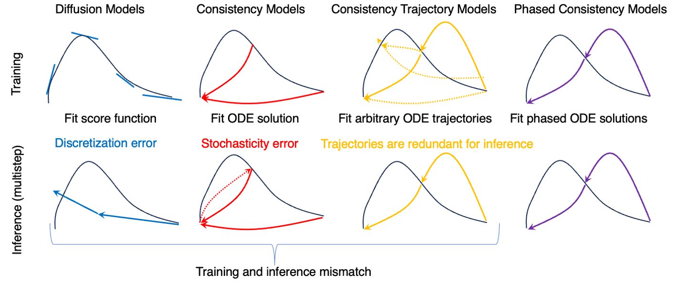
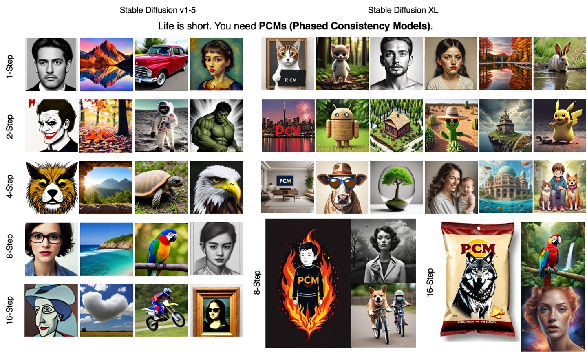
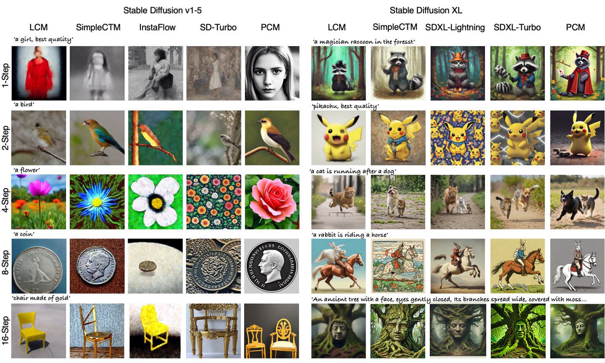

<div align="center">

## ⚡️Phased Consistency Model⚡️

[[Paper]](https://arxiv.org/pdf/2405.18407) [[Project Page ✨]](https://g-u-n.github.io/projects/pcm/) [[Demo in 🤗Hugging Face]](None) [[Pre-trained Models]](None) [[Civitai]](None)  


by *Fu-Yun Wang<sup>1</sup>, Zhaoyang Huang<sup>2</sup>, Alexander William Bergman<sup>3,6</sup>, Dazhong Shen<sup>4</sup>, 
Peng Gao<sup>4</sup>, Michael Lingelbach<sup>3,6</sup>, Keqiang Sun<sup>1</sup>, Weikang Bian<sup>1</sup>
Guanglu Song<sup>5</sup>, Yu Liu<sup>4</sup>, Hongsheng Li<sup>1</sup>, Xiaogang Wang<sup>1</sup>* 

*<sup>1</sup>CUHK-MMLab   <sup>2</sup>Avolution AI   <sup>3</sup>Hedra  <sup>4</sup>Shanghai AI Lab   <sup>5</sup>SenseTime  <sup>6</sup>Stanford University*
</div>

```bib
@article{wang2024phased,
  title={Phased Consistency Model},
  author={Wang, Fu-Yun and Huang, Zhaoyang and Bergman, Alexander William and Shen, Dazhong and Gao, Peng and Lingelbach, Michael and Sun, Keqiang and Bian, Weikang and Song, Guanglu and Liu, Yu and others},
  journal={arXiv preprint arXiv:2405.18407},
  year={2024}
}
```

### News

- [2024.06.01]: Release Training Script of PCM-LoRA with Stable Diffusion v1.5. Happy Children's Day! Never too old to celebrate the joys of childhood!
- [2024.05.30]: [Technical report](https://arxiv.org/pdf/2405.18407) is available on arXiv.


## Introduction

Phased Consistency Model (PCM) is (probably) current one of the most powerful sampling acceleration strategy for fast text-conditioned image generation in large diffusion models. 

Consistecny Model (CM), proposed by Yang Song et al, is a promising new famility of generative models that can generate high-fiedilty images with very few steps (generally 2 steps) under the unconditional and class-conditional settings.  Previous work, latent-consistency model (LCM), tried to replicate the power of consistency models for text-conditioned generation, but generally failed to achieve pleasant results, especially in low-step regime (1~4 steps). Instead,  we believe PCM is a much more successful extension to the original consistency models for high-resolution, text-conditioned image generation, better replicating the power of original consistency models for more advanced generation settings.

Generally, we show there are mainly three limitations of (L)CMs:

- LCM lacks flexibility for CFG choosing and is insensitive to negative prompts.
- LCM fails to produce consistent results under different inference steps. Its results are blurry when step is too large (Stochastic sampling erorr) or small (inability).
- LCM produces bad and blurry results at low-step regime.

These limitaions can be explicitly viewed from the following figure.

***We generalize the design space of consistency models for high-resolution text-conditioned image generation, analyzing and tackling the limitations in the previous work LCM.***

<div align="center">
  
</div>


### PF-ODE

**Diffusion model**, from a continious time perspective, actually defines a forward conditional probability path, with a general representation of $\alpha_t \mathbf x_0 + \sigma_t \boldsymbol \epsilon \sim \mathcal N(\alpha_t\mathbf x_0, \sigma_{t}^2\mathbf I)$ for intermediate distribution $\mathbb P_{t}(\mathbf x | \mathbf x_0)$ conditioned on $\mathbf x_0$, which is quivalent to the stochasitic differential equation $\mathrm d\mathbf x_{t} = f_{t} \mathbf x_{t} \mathrm d t + g_{t} \mathrm d \boldsymbol w_{t}$ with $w_{t}$ denoting the standard Winer process.


For the forward SDE, a remarkable property is that there exists a reverse time ODE trajectory, which is termed as PF ODE by song et al, which does not introduce additional stochasticity and still satisfy the pre-defined marginal distribution, that is 

$\mathrm d \mathbf x = (f_t - \frac{1}{2} g_{t}^2 \nabla_{\mathbf x} \log \mathbb P_{t}(\mathbf x)) \mathrm d t$,

where $\mathbb P_{t}(\mathbf x)= \mathbb E\left[\mathbb P_{t}(\mathbf x|\mathbf x_{0})| \mathbf x_{0}\right]$. The diffusion training process inherently trains a score estimator with deep neural network ($\boldsymbol s_{\theta}$). 

Generally say, there are just infinite probable paths for reversing the SDE. However, the ODE trajectory, without any stochasticity, is basically more stable for sampling. Most schedulers, including DDIM, DPM-solver, Euler, and Heun, etc., applied in the stable diffusion community are generally based on the principle of  better approximating the ODE trajectory.  Most distillation-based methods including rectified-flow, guided distillation, can also generally be seen as better approximating the ODE trajectory with larger steps (though most of them did not discuss the relevant parts).

**Consistency models aims directly learn the solution point of the ODE trajectory either through distillation or training.** 

>  In PCMs, we focus our work on the distillation, which is generally easier for learning. For training, we leave it for futural research.

### Learning Paradigm Comparison

Consistency Trajctory Model (CTM) points out that CM suffer from the sthochasticity error accumulation when applied for multistep sampling for better sample quality and propose a more general framework, allowing for abitrary pair moving along the ODE trajectory. Yet, it requires an additional target timesteps embedding, which is not aligned with design space of traditional diffusion models.  Additionally, CTM is basically harder to train. Say we discritizing the ODE trajectory into $N$ points, the learning objective of diffusion models and consistency models are all $\mathcal O( N)$. Yet the number of learning objectives of CTM is $\mathcal O(N^2)$. Our proposed PCM, also solving the sthochasticity error accumulation, but is much easier for training. 

**The core idea of our method is phasing the whole ODE trajectory into multiple sub-trajectories.**  The following figure illustrates the learning pradigm difference among diffusion models (DMs), consistency models (CMs), consistency trajctory models (CTMs), and our proposed phased consistency models (PCMs).


<div align="center">
  
</div>


For a better comparison, we also implement a baseline, which we termed as simpleCTM. We adapt the high-level idea of CTM from the k-diffusion framework into the DDPM framework with stable diffusion, and compare its performance. When trained with the same resource, our method achieves significant superior performance. 


## Samples of PCM

PCM can achieve text-conditioned image synthesis with good quality in 1, 2, 4, 8, 16 steps. 

<div align="center">
  
</div>

## Comparison

PCM achieves advanced generation results compared with current open-available powerful fast generation models, including the GAN-based methods: SDXL-Turbo, SD-Turbo, SDXL-Lightning; rectified-flow-based method: InstaFlow;  CM-based methods: LCM, SimpleCTM. 

<div align="center">
  
</div>


## Concact & Collaboration

If you have any questions about the code, please do not hesitate to contact me!

Email: fywang@link.cuhk.edu.hk


